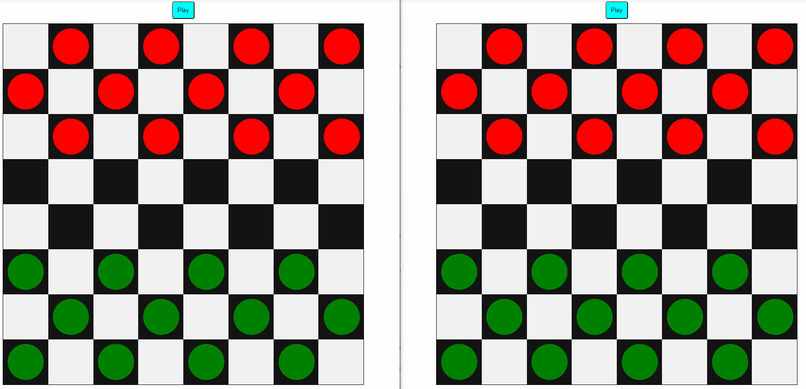

# COVID19 Statistics

## Description

Attempt at making client-server communication using NodeJS and socket.io. The logic of checkers is not relevant to this project, but rather the overall functionality. A database will be integrated through NodeJS and MySQL (phpMyAdmin).

## Current Stage

## Usage:

Visit https://github.com/lbragile/checkers-socket.io

## Todo

- [ ] Fix logic so that both sides can move properly.
- [ ] Login system (with sign up and email confirmation?) that stores data in the database.
- [ ] Rating adjustments (optional)
- [ ] Time per game (optional)

