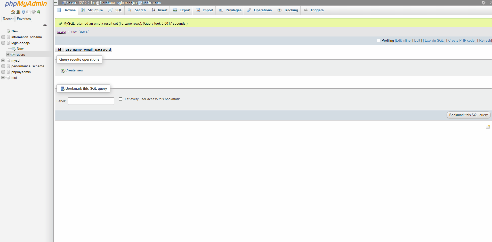

# Login & User Authentication System + Multi-Client Communication

## Description

Attempt at making client-server communication using NodeJS and socket.io. The logic of the tic-tac-toe game is not relevant to this project, but rather the overall functionality of the system is what counts. A database is integrated through NodeJS and MySQL (phpMyAdmin) which uses password encryption for security, email verification upon registration is made, JSON web tokens and cookies are used to verify users and maintain smooth status transitions over many tabs, sockets are used for multi-client communication through a central server, templating is used for simple markup error handling and code reuse.

## Current Stage

## Todo

- [x] Fix logic so that both sides can move properly (doesn't have to be correct logic of the game).
- [x] Login system (with sign up and email confirmation?) that stores data in the database.

## Credit

The tic-tac-toe logic was found here: https://codepen.io/vasanthkay/pen/KVzYzG and slightly modified to fit the needs of this project.